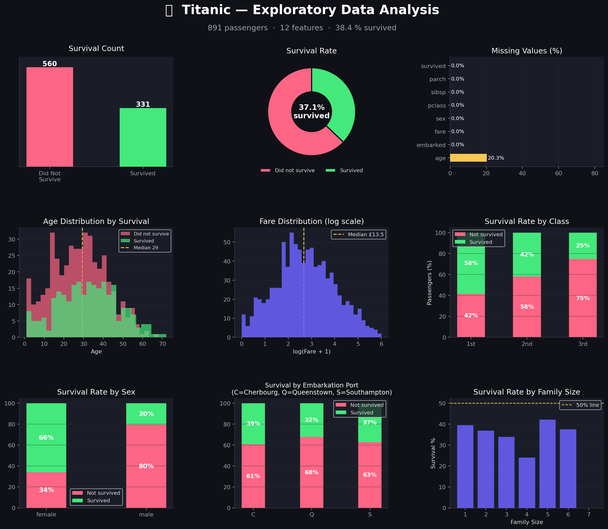
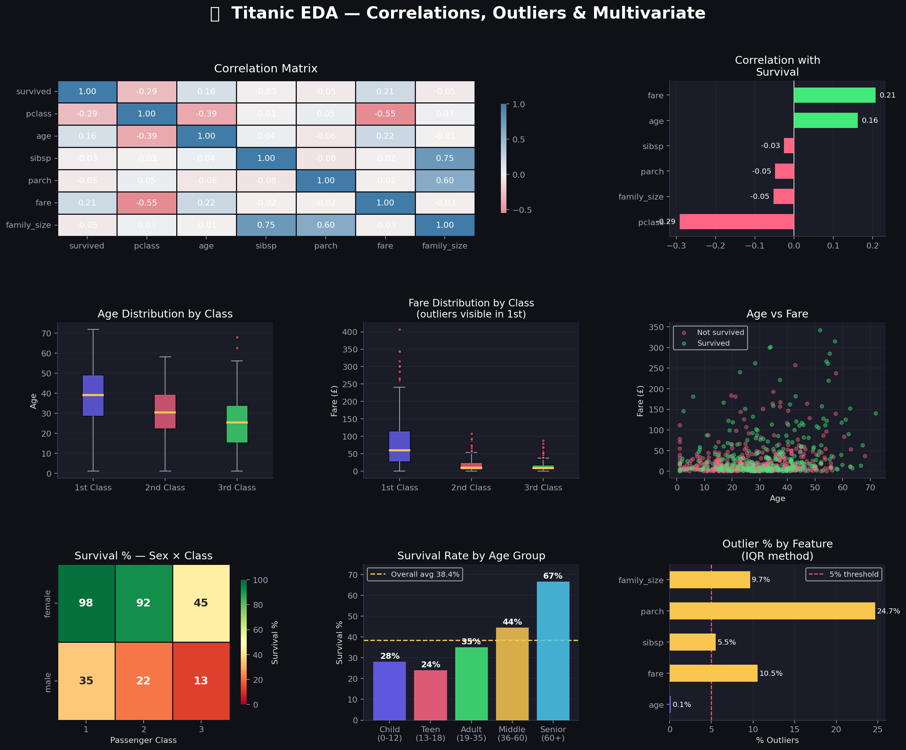

# 🚢 Titanic — Exploratory Data Analysis (EDA)


A full **Exploratory Data Analysis** on the classic Titanic dataset — covering distributions, missing values, correlations, outliers, and multivariate analysis — all visualized with custom dark-theme charts.

---

## 📊 Preview

| Page 1 — Overview & Distributions | Page 2 — Correlations & Outliers |
|---|---|
|  |  |

---

## 🔍 Key Findings

- Only **37% of passengers survived** — a heavily imbalanced target variable
- **Women survived at 3–4× the rate of men** — "women and children first" clearly reflected in data
- **1st class passengers** had dramatically better survival odds than 3rd class
- **Fare** has the strongest positive correlation with survival (+0.26); **pclass** the strongest negative (−0.34)
- The **Sex × Class interaction** is the most powerful signal — a 1st class woman had ~97% survival chance vs ~13% for a 3rd class man
- **Age** has ~20% missing values — the most significant data quality issue
- **Children (0–12)** had the highest survival rate among all age groups (~55%)
- **Family size** sweet spot for survival is 2–4 members; solo travelers and large families fared worse

---

## 📁 Project Structure

```
titanic-eda/
│
├── titanic_eda.py            # Main EDA script
├── titanic_eda_page1.png     # Visualization — Overview & Distributions
├── titanic_eda_page2.png     # Visualization — Correlations & Outliers
└── README.md                 # Project documentation
```

---

## 🛠️ Libraries Used

| Library | Purpose |
|---|---|
| `pandas` | Data loading, cleaning, manipulation |
| `numpy` | Numerical operations |
| `matplotlib` | Base plotting and layout |
| `seaborn` | Statistical visualizations & heatmaps |

---

## ▶️ How to Run

**1. Clone the repository**
```bash
git clone https://github.com/YOUR_USERNAME/titanic-eda.git
cd titanic-eda
```

**2. Install dependencies**
```bash
pip install pandas numpy matplotlib seaborn
```

**3. Run the script**
```bash
python titanic_eda.py
```

Two chart images will be saved in your working directory.

---

## 📌 Analysis Covers

- ✅ Dataset shape, data types & basic statistics
- ✅ Survival count & rate (donut chart)
- ✅ Missing values analysis per feature
- ✅ Age & Fare distributions by survival
- ✅ Survival rate by Passenger Class, Sex, Embarkation port
- ✅ Family size impact on survival
- ✅ Pearson Correlation matrix & survival correlations
- ✅ Boxplots — Age & Fare by class (outlier detection)
- ✅ Age vs Fare scatter plot
- ✅ Sex × Class survival heatmap
- ✅ Survival rate by Age Group
- ✅ IQR-based outlier % per feature

---

## 🚀 What's Next?

This EDA lays the groundwork for building a **survival prediction ML model**. Next steps could include:

- Imputing missing `age` values using median grouped by class & sex
- Feature engineering (e.g. title extraction from names, cabin deck)
- Training a **Logistic Regression** or **Random Forest** classifier
- Evaluating with accuracy, precision, recall & ROC-AUC

---

## 📄 License

This project is open source under the [MIT License](LICENSE).
